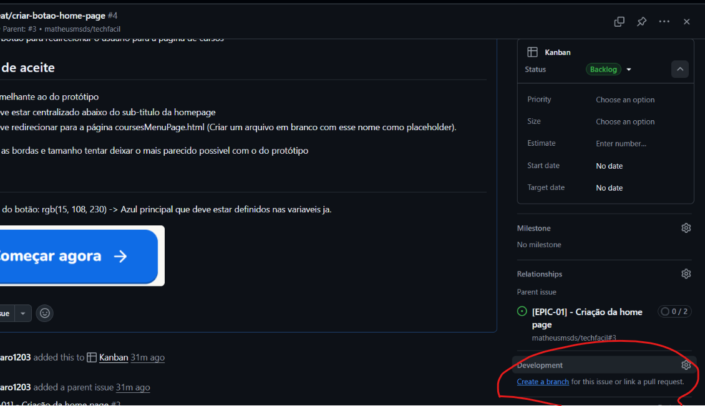

# Boas Práticas de Desenvolvimento Apex Software

Este documento visa definir algumas regras gerais durante o desenvolvimento do TechFacil.

1. Versionamento de código

- **Branches**
  - Sempre trabalhar nas branch de desenvolvimento. **Nunca** commitar **NADA** direto em 'dev' ou na 'main'.
  - Quando for trabalhar em uma nova feature ou numa correção de bug é obrigatório criar uma branch para isso.
  - Nomenclatura de branches:
    - `feature/'nome-do-feature'`
    - `fix/'nome-do-bugfix'`
    - `refactor/'nome-do-refactor'`
- **Commits**:
  - Sempre fazer commits atomicos. Ou seja, cada commit deve conter apenas uma mudança.
  - Sempre fazer commits descritivos. Ou seja, cada commit deve ter uma descrição clara do que foi feito.
  - Sempre fazer commits em portugues do brasil.
  - Exemplo de commit: `git commit -m "feat: add nova feature"`
  - Exemplo de commit: `git commit -m "fix: bug X resolvido"`
  - Exemplo de commit: `git commit -m "refactor: remocao de codigo duplicado em X"`
- **Pull Requests**:
  - Sempre fazer pull requests descritivos. Ou seja, cada pull request deve ter uma descrição clara do que foi feito.
  - Sempre fazer pull requests em portugues do brasil.
  - Pull requests devem ser sempre abertas para a branch 'dev'. **nunca** para 'main'. **Cuidado** pois por padrão o github as vezes coloca pra fazer o pull request para 'main'.
  - Os merges sempre serão aceitos por um único responsavel.
  - O responsavel é o único que pode fazer o merge do pull request. Portanto, **nunca** faça o merge do seu próprio pull request.
  - **Criando uma branch**
  Para manter padronizado podemos seguir a pratica de criar uma branch a partir da issue no github.

  

2. **Kanban**

As tasks serão distribuidas no quadro kanban no github, la definiremos o que cada um vai fazer e organizaremos o projeto.
Atualmente temos 5 colunas:

- **Backlog** - Definição inicial, ainda pode ser alterado.
- **Ready** - Pronto para ser desenvolvido.
- **In Progress** - Em desenvolvimento.
- **Review** - Em revisão.
- **Done** - Concluído.

**Regras gerais:**

- Para começar a trabalhar em uma nova tarefa é obrigatório que a task esteja na coluna **Ready**.
- **Nunca** comece a trabalhar em uma task que não esteja na coluna **Ready**.
- **Nunca** mova uma task para a coluna **Review** se a task não estiver com PR aberto.
- **Nunca** mova uma task para a coluna **Done** se a task não estiver na coluna **Review**.
